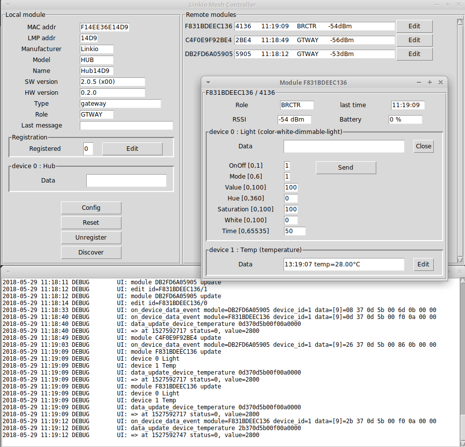

# python-lmp-client

A simple python GUI to control Linkio's BLE modules and BLE Linkio MESH network.
This interface written in Python-Tk provides some way to :
- configure and control a Linkio BLE module through its serial interface,
- monitor the MESH network on which the module is connected to,
- control any other Linkio BLE modules or compatible products within the MESH network.

## Prerequisites
- a Linux PC or Raspberry with serial port
- Python 2.7

## Preparation
- connect your Linkio dongle (see the complete list of compatible products below),
- download the Linkio App on your smartphone from the stores :
    - https://play.google.com/store/apps/details?id=net.linkio.mainapp
    - https://itunes.apple.com/FR/app/id1280853273


- run the GUI in a terminal :
```
./lmpclient.py
```
- build up your MESH network with the App by registering all the products including your dongle. The products should appears in the `Remote modules` list.

## Usage
- Monitor the products in your MESH from the `Remote modules` list,
- control individually one remote module from its window.

 

## List of compatible products

The following products can be connected to the serial interface and can be controlled gy the GUI :
- LIO52 USB dongle
- XBEE Linkio module
- LIO52 module with LIO52 Linkio MESH Network software

Any product built with a Linkio module embedding the Linkio MESH network can be controlled by the GUI.
